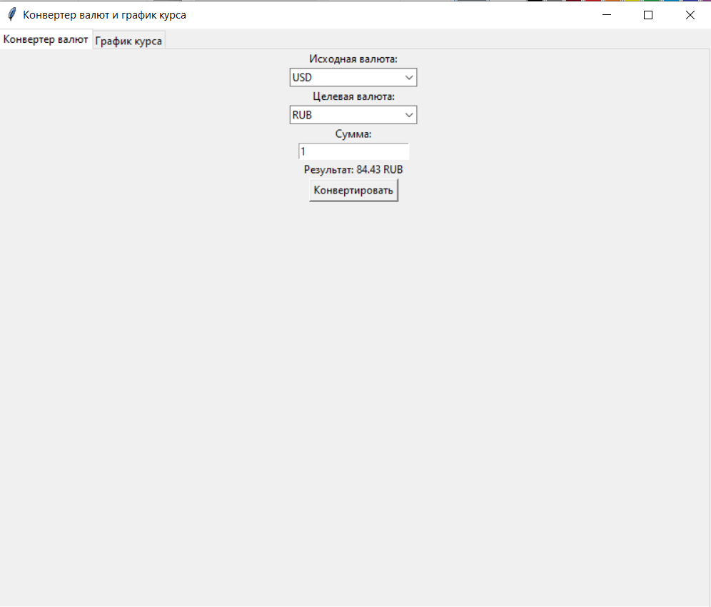
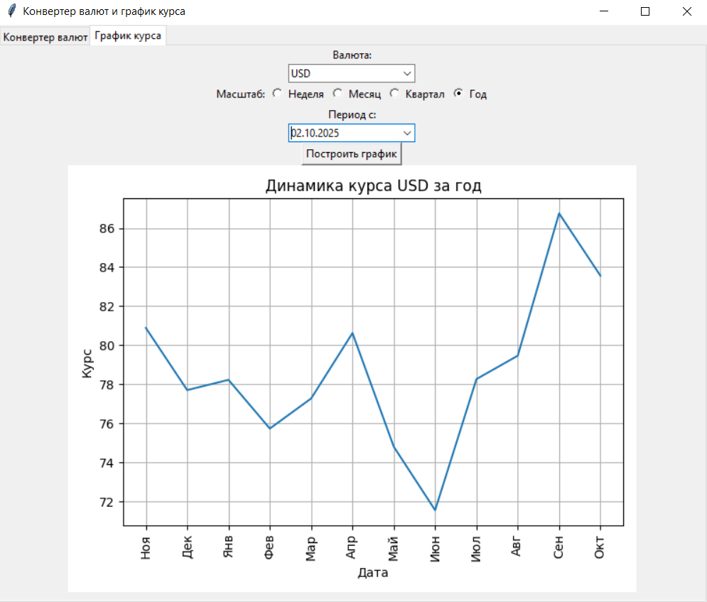

# Currency Tracker 

GUI-приложение на Python для конвертации валют и построения графиков динамики курса. Данные берутся с официального сайта Центрального Банка РФ.

## Возможности

- **Конвертер валют** — перевод суммы из одной валюты в другую по актуальному курсу ЦБ РФ.
- **График курса** — построение графика динамики курса выбранной валюты за период (неделя, месяц, квартал, год).
- **Актуальные данные** — курсы подгружаются напрямую с `cbr.ru` через XML API.

## Стек

- **Python 3.10+**
- **Tkinter** — графический интерфейс
- **Requests** — HTTP-запросы к API ЦБ РФ
- **xml.etree.ElementTree** — парсинг XML
- **Matplotlib** — построение графиков
- **python-dateutil** — работа с датами

## Установка

1. Клонируйте репозиторий:

   ```bash
   git clone https://github.com/ваш-ник/currency-tracker.git
   cd currency-tracker
   ```

2. Установите зависимости:

   ```bash
   pip install -r requirements.txt
   ```

3. Запустите приложение:

   ```bash
   python main.py
   ```

## Скриншоты

### Конвертер валют



### График курса



## Как пользоваться

### Конвертер

1. Выберите исходную валюту.
2. Выберите целевую валюту.
3. Введите сумму.
4. Нажмите «Конвертировать».

### График

1. Выберите валюту.
2. Выберите масштаб (Неделя / Месяц / Квартал / Год).
3. Выберите дату начала периода.
4. Нажмите «Построить график».

## Структура проекта

```
currency-tracker/
├── main.py              # Точка входа
├── requirements.txt     # Зависимости
├── README.md
├── screenshots/         # Скриншоты
└── src/
    ├── api.py           # Работа с API ЦБ РФ
    ├── graph.py         # Построение графиков
    └── gui.py           # Интерфейс на Tkinter
```
